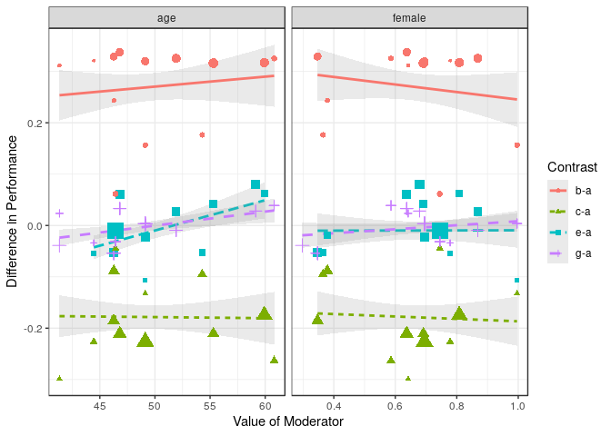
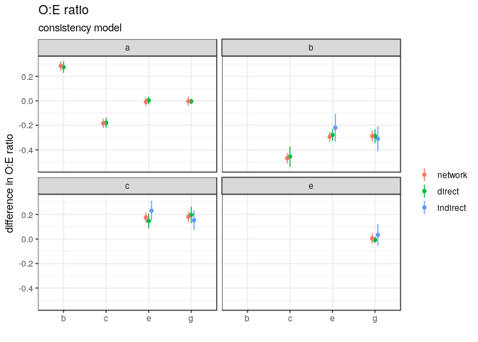
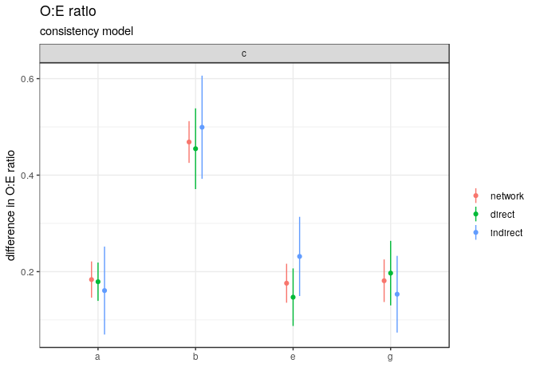

<!-- README.md is generated from README.Rmd. Please edit that file -->

# mscpredmodel

The goal of mscpredmodel is to make external validation and comparison
of prediction models via the network meta-analytic approach multiple
score comparison (MSC) straightforward for researchers involved in
systematic reviews and (network) meta-analysis of prediction models.

## Installation

You can install the released version of mscpredmodel from
[github](https://github.com/) with:

``` r
devtools::install_github("srhaile/mscpredmodel")
```

## Example

This is a basic example which shows you a typical analysis for a dataset
having individual patient data for 30 cohorts, each with some
combination of scores a, b, c, e, and g. The example here has only 25
bootstrap samples to speed up the runtime, but an actual analysis should
use more.

``` r
library(mscpredmodel)
library(ggplot2)
theme_set(theme_bw())

dat <- msc_sample_data()
head(dat)
#>     study  id outcome    a    b    c    d    e    f    g  h  i age female    x1
#> 1.1     1   1       1 0.53   NA   NA   NA 0.52 0.54 0.52 NA NA  43      1 -0.78
#> 1.2     1  10       0 0.41 0.30 0.54 0.33 0.44 0.39 0.43 NA NA  47      0  1.60
#> 1.3     1 100       0 0.56   NA 0.68 0.62 0.54 0.57 0.55 NA NA  39      0  0.73
#> 1.4     1 101       1 0.44 0.32 0.57 0.38 0.46 0.43 0.45 NA NA  52      1  2.03
#> 1.5     1 102       0 0.41   NA   NA 0.32   NA 0.38 0.42 NA NA  51      0  0.14
#> 1.6     1 103       0   NA   NA 0.67 0.61 0.54 0.57 0.55 NA NA  47      1  1.19

M <- 25
bs.example <- get_bs_samples(data = dat, id = id, cohort = study, 
                             outcome = outcome, n.samples = M, 
                             scores = c("a", "b", "c", "e", "g"), 
                             moderators = c("age", "female"))
ps <- compute_performance(bs.example, fn = calibration_large, 
                          lbl = "calibration-in-the-large")
summary(ps)
#>   score nonmiss median    q1    q3
#> 1     a      15  0.012 -0.47  0.23
#> 2     b      13  0.479  0.03  0.75
#> 3     c      12 -0.398 -0.98 -0.22
#> 4     e      12 -0.113 -0.47  0.22
#> 5     g      11 -0.172 -0.50  0.27

agg <- aggregate_performance(ps, reference = "b")
check_transitivity(agg, graph = TRUE)
#> Warning in qt(a, object$df.residual): NaNs produced

#> Warning in qt(a, object$df.residual): NaNs produced

#> Warning in qt(a, object$df.residual): NaNs produced

#> Warning in qt(a, object$df.residual): NaNs produced

#> Warning in qt(a, object$df.residual): NaNs produced

#> Warning in qt(a, object$df.residual): NaNs produced
#> Warning: The shape palette can deal with a maximum of 6 discrete values because more than 6
#> becomes difficult to discriminate; you have 7. Consider specifying shapes manually if you
#> must have them.
#> Warning: Removed 72 rows containing missing values (geom_point).
```



    #> # A tibble: 12 x 9
    #>    contr moderator term   estimate std.error statistic   p.value   conf.low conf.high
    #>    <fct> <fct>     <chr>     <dbl>     <dbl>     <dbl>     <dbl>      <dbl>     <dbl>
    #>  1 a-b   age       age      0.0696    0.0211      3.30   0.00708   0.0232      0.116 
    #>  2 c-b   age       age      0.0428    0.0231      1.85   0.102    -0.0106      0.0961
    #>  3 e-b   age       age      0.0730    0.0314      2.33   0.0483    0.000686    0.145 
    #>  4 g-b   age       age      0.0622    0.0239      2.60   0.0316    0.00704     0.117 
    #>  5 c-a   age       age      0.0959  NaN         NaN    NaN       NaN         NaN     
    #>  6 e-a   age       age      0.112   NaN         NaN    NaN       NaN         NaN     
    #>  7 a-b   female    female   1.88      0.747       2.52   0.0284    0.239       3.53  
    #>  8 c-b   female    female   2.28      0.797       2.86   0.0211    0.442       4.12  
    #>  9 e-b   female    female   1.36      1.28        1.07   0.318    -1.59        4.32  
    #> 10 g-b   female    female   2.57      0.753       3.42   0.00910   0.837       4.31  
    #> 11 c-a   female    female  -5.24    NaN         NaN    NaN       NaN         NaN     
    #> 12 e-a   female    female  -6.14    NaN         NaN    NaN       NaN         NaN
    
    modc <- consistency(agg)
    modi <- inconsistency(agg)
    modi
    #> 
    #> Multivariate Meta-Analysis Model (k = 48; method: REML)
    #> 
    #> Variance Components:
    #> 
    #> outer factor: cohort (nlvls = 15)
    #> inner factor: contr  (nlvls = 7)
    #> 
    #>             estim    sqrt  fixed 
    #> tau^2      0.1571  0.3964     no 
    #> rho        0.5000            yes 
    #> 
    #> outer factor: design (nlvls = 7)
    #> inner factor: contr  (nlvls = 7)
    #> 
    #>             estim    sqrt  fixed 
    #> gamma^2    0.0000  0.0000     no 
    #> phi        0.5000            yes 
    #> 
    #> Test for Residual Heterogeneity:
    #> QE(df = 44) = 371.5608, p-val < .0001
    #> 
    #> Test of Moderators (coefficients 1:4):
    #> QM(df = 4) = 36.3859, p-val < .0001
    #> 
    #> Model Results:
    #> 
    #>    estimate      se     zval    pval    ci.lb    ci.ub 
    #> a   -0.2214  0.1151  -1.9232  0.0545  -0.4470   0.0042    . 
    #> c   -0.7236  0.1248  -5.7965  <.0001  -0.9683  -0.4789  *** 
    #> e   -0.2832  0.1235  -2.2934  0.0218  -0.5253  -0.0412    * 
    #> g   -0.2590  0.1258  -2.0587  0.0395  -0.5055  -0.0124    * 
    #> 
    #> ---
    #> Signif. codes:  0 '***' 0.001 '**' 0.01 '*' 0.05 '.' 0.1 ' ' 1
    
    check_homogeneity(modi)
    #>   tau2  QE df   QEp
    #> 1 0.16 372 44 2e-53
    check_consistency(ps)



``` r

fullres <- msc_full(ps)
plot(fullres, compare_to = "c")
```


